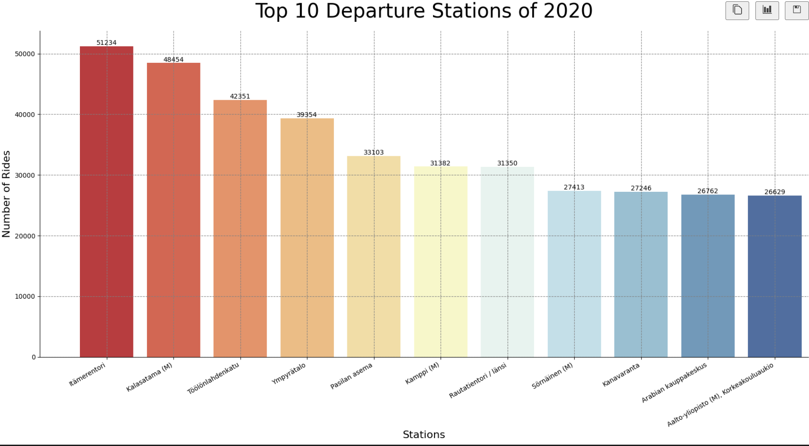

# Data analysis
- Document here the project: HelsinkiCityBikes
- Data Source: https://www.kaggle.com/code/geometrein/helsinki-city-bike-network-analysis/data
- Type of analysis: Advanced EDA

An advanced analysis of the Kaggle Helsinki City Bikes Dataset which includes ride time distrubution, hourly departure locations, temperature analysis, top pickup and drop-off locations, and total rides per day of the week.




# Startup the project

The initial setup.

Create virtualenv and install the project:
```bash
sudo apt-get install virtualenv python-pip python-dev
deactivate; virtualenv ~/venv ; source ~/venv/bin/activate ;\
    pip install pip -U; pip install -r requirements.txt
```

Unittest test:
```bash
make clean install test
```

Check for HelsinkiCityBikes in gitlab.com/{group}.
If your project is not set please add it:

- Create a new project on `gitlab.com/{group}/HelsinkiCityBikes`
- Then populate it:

```bash
##   e.g. if group is "{group}" and project_name is "HelsinkiCityBikes"
git remote add origin git@github.com:{group}/HelsinkiCityBikes.git
git push -u origin master
git push -u origin --tags
```

Functionnal test with a script:

```bash
cd
mkdir tmp
cd tmp
HelsinkiCityBikes-run
```

# Install

Go to `https://github.com/{group}/HelsinkiCityBikes` to see the project, manage issues,
setup you ssh public key, ...

Create a python3 virtualenv and activate it:

```bash
sudo apt-get install virtualenv python-pip python-dev
deactivate; virtualenv -ppython3 ~/venv ; source ~/venv/bin/activate
```

Clone the project and install it:

```bash
git clone git@github.com:{group}/HelsinkiCityBikes.git
cd HelsinkiCityBikes
pip install -r requirements.txt
make clean install test                # install and test
```
Functionnal test with a script:

```bash
cd
mkdir tmp
cd tmp
HelsinkiCityBikes-run
```
